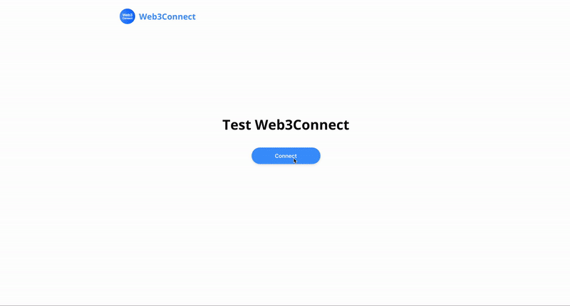

# Web3Modal

A single Web3 / Ethereum provider solution for all Wallets

## Introduction

Web3Modal is an easy-to-use library to help developers add support for multiple providers in their apps with a simple customizable configuration.

By default Web3Modal Library supports injected providers like (**Metamask**, **Dapper**, **Gnosis Safe**, Web3 Browsers, etc) and **WalletConnect**, You can also easily configure the library to support **Portis**, **Fortmatic**, **Squarelink**, **Torus**, **Authereum**, **D'CENT Wallet** and **Arkane**.

## Preview

You can test the library on: https://web3modal.com/



## Projects using `web3modal`

_Open a PR to add your project to the list!_

- [DAO Stack](https://alchemy.daostack.io/)
- [Gnosis Safe](https://gnosis-safe.io/)
- [3Box Hub](https://3box.io/hub/)
- [KnownOrigin](https://knownorigin.io/)
- [Clovers Network](https://clovers.network/)
- [Affogato](https://affogato.co/)
- [Linkdrop](https://dashboard.linkdrop.io/)
- [Dapparatus](https://github.com/austintgriffith/dapparatus/)
- [Totle Swap](https://swap.totle.com/)
- [Win Or Lose](https://www.winorlose.live/)

## Related Efforts

- [web3-react](https://github.com/NoahZinsmeister/web3-react/)

## Usage

1. Install Web3Modal NPM package

```bash
npm install --save web3modal

# OR

yarn add web3modal
```

2. Install Provider packages

```js
/* See Provider Options Section */
```

3. Then you can add Web3Modal to your Dapp as follows

```js
import Web3 from "web3";
import Web3Modal from "web3modal";

const providerOptions = {
  /* See Provider Options Section */
};

const web3Modal = new Web3Modal({
  network: "mainnet", // optional
  cacheProvider: true, // optional
  providerOptions // required
});

const provider = await web3Modal.connect();

const web3 = new Web3(provider);
```

## Using in vanilla JavaScript

You can use the modal from the old fashioned web page JavaScript as well.

[First get a Web3modal bundled JavaScript from Releases](https://github.com/Web3Modal/web3modal/releases).

After including the bundle in your HTML, you can use it on your web page:

```js
//  You have to refer to default since it was bundled for ESModules
// but after that the documentation will be the same

const Web3Modal = window.Web3Modal.default;
const providerOptions = {
  /* See Provider Options Section */
};

const web3Modal = new Web3Modal({
  network: "mainnet", // optional
  cacheProvider: true, // optional
  providerOptions // required
});

const provider = await web3Modal.connect();
```

[See the full vanilla JavaScript example application](https://github.com/Web3Modal/web3modal-vanilla-js-example).

## Provider Events

You should subscribe to provider events compatible with [EIP-1193](https://eips.ethereum.org/EIPS/eip-1193) standard.

```typescript
// Subscribe to accounts change
provider.on("accountsChanged", (accounts: string[]) => {
  console.log(accounts);
});

// Subscribe to chainId change
provider.on("chainChanged", (chainId: number) => {
  console.log(chainId);
});

// Subscribe to provider connection
provider.on("connect", (info: { chainId: number }) => {
  console.log(info);
});

// Subscribe to provider disconnection
provider.on("disconnect", (error: { code: number; message: string }) => {
  console.log(error);
});
```

## Provider Options

These are all the providers available with Web3Modal and how to configure their provider options

### WalletConnect

1. Install Provider Package

```bash
npm install --save @walletconnect/web3-provider

# OR

yarn add @walletconnect/web3-provider
```

2. Set Provider Options

```typescript
import WalletConnectProvider from "@walletconnect/web3-provider";

const providerOptions = {
  walletconnect: {
    package: WalletConnectProvider, // required
    options: {
      infuraId: "INFURA_ID" // required
    }
  }
};
```

[See the full list of options for WalletConnect Web3 provider](https://docs.walletconnect.org/quick-start/dapps/web3-provider).

**Note:** A WalletConnect instance is available on the provider as `provider.wc`

### Fortmatic

1. Install Provider Package

```bash
npm install --save fortmatic

# OR

yarn add fortmatic
```

2. Set Provider Options

```typescript
import Fortmatic from "fortmatic";

const providerOptions = {
  fortmatic: {
    package: Fortmatic, // required
    options: {
      key: "FORTMATIC_KEY" // required
    }
  }
};
```

**Note:** A Fortmatic instance is available on the provider as `provider.fm`

### Torus

For more info please refer to Torus [documentation](https://docs.tor.us)

1. Install Provider Package

```bash
npm install --save @toruslabs/torus-embed

# OR

yarn add @toruslabs/torus-embed
```

2. Set Provider Options

```typescript
import Torus from "@toruslabs/torus-embed";

const providerOptions = {
  torus: {
    package: Torus, // required
    options: {
      networkParams: {
        host: "https://localhost:8545", // optional
        chainId: 1337, // optional
        networkId: 1337 // optional
      },
      config: {
        buildEnv: "development" // optional
      }
    }
  }
};
```

**Note:** A Torus instance is available on the provider as `provider.torus`

### Authereum

1. Install Provider Package

```bash
npm install --save authereum

# OR

yarn add authereum
```

2. Set Provider Options

```typescript
import Authereum from "authereum";

const providerOptions = {
  authereum: {
    package: Authereum // required
  }
};
```

**Note:** An Authereum instance is available on the provider as `provider.authereum`

### UniLogin

1. Install Provider Package

```bash
npm install --save @unilogin/provider

# OR

yarn add @unilogin/provider
```

2. Set Provider Options

```typescript
import UniLogin from "@unilogin/provider";

const providerOptions = {
  unilogin: {
    package: UniLogin // required
  }
};
```

### BurnerConnect

1. Install Provider Package

```bash
npm install --save @burner-wallet/burner-connect-provider

# OR

yarn add @burner-wallet/burner-connect-provider
```

2. Set Provider Options

```typescript
import BurnerConnectProvider from "@burner-wallet/burner-connect-provider";

const providerOptions = {
  burnerconnect: {
    package: BurnerConnectProvider, // required
    options: {
      defaultNetwork: "100"
    }
  }
};
```

### Portis

1. Install Provider Package

```bash
npm install --save @portis/web3

# OR

yarn add @portis/web3
```

2. Set Provider Options

```typescript
import Portis from "@portis/web3";

const providerOptions = {
  portis: {
    package: Portis, // required
    options: {
      id: "PORTIS_ID" // required
    }
  }
};
```

**Note:** A Portis instance is available on the provider as `provider._portis`

### Squarelink

1. Install Provider Package

```bash
npm install --save squarelink

# OR

yarn add squarelink
```

2. Set Provider Options

```typescript
import Squarelink from "squarelink";

const providerOptions = {
  squarelink: {
    package: Squarelink, // required
    options: {
      id: "SQUARELINK_ID" // required
    }
  }
};
```

**Note:** A Squarelink instance is available on the provider as `provider.sqlk`

### Arkane

1. Install Provider Package

```bash
npm install --save @arkane-network/web3-arkane-provide

# OR

yarn add @arkane-network/web3-arkane-provide
```

2. Set Provider Options

```typescript
import Arkane from "@arkane-network/web3-arkane-provider";

const providerOptions = {
  arkane: {
    package: Arkane, // required
    options: {
      clientId: "ARKANE_CLIENT_ID" // required
    }
  }
};
```

### MEW connect protocol (MEW wallet)

1. Install Provider Package

```bash
npm install --save @myetherwallet/mewconnect-web-client

# OR

yarn add @myetherwallet/mewconnect-web-client
```

2. Set Provider Options

```typescript
import MewConnect from "@myetherwallet/mewconnect-web-client";

const providerOptions = {
  mewconnect: {
    package: MewConnect, // required
    options: {
      infuraId: "INFURA_ID" // required
    }
  }
};
```

### D'CENT Wallet

1. Install Provider Package

```bash
npm install --save dcent-provider
# OR
yarn add dcent-provider
```

2. Set Provider Options

```typescript
import DcentProvider from "dcent-provider";
const providerOptions = {
  dcentwallet: {
    package: DcentProvider, // required
    options: {
      rpcUrl: "INSERT_RPC_URL" // required
    }
  }
};
```

### Bitski

1. Install Provider Package

```bash
npm install --save bitski
# OR
yarn add bitski
```

2. Set Provider Options

```typescript
import { Bitski } from "bitski";
const providerOptions = {
  bitski: {
    package: Bitski, // required
    options: {
      clientId: "BITSKI_CLIENT_ID" // required, 
      callbackUrl: "BITSKI_CALLBACK_URL" // required
    }
  }
};
```

## API

```typescript
class Web3Modal {
  cachedProvider: string;
  connect(): Promise<any>;
  connectTo(id: string): Promise<any>;
  toggleModal(): Promise<void>;
  on(event: string, callback: SimpleFunction): SimpleFunction;
  off(event: string, callback?: SimpleFunction): void;
  clearCachedProvider(): void;
  setCachedProvider(): void;
  updateTheme(theme: string | ThemeColors): Promise<void>;
}
```

## Utis

```typescript
function getInjectedProvider(): IProviderInfo | null;
function getInjectedProviderName(): string | null;

function getProviderInfo(provider: any): IProviderInfo;
function getProviderInfoByName(name: string | null): IProviderInfo;
function getProviderInfoById(id: string | null): IProviderInfo;
function getProviderInfoByCheck(check: string | null): IProviderInfo;
```

## Types

```typescript
interface IProviderInfo {
  id: string;
  type: string;
  check: string;
  name: string;
  logo: string;
  description?: string;
  package?: {
    required?: string[];
  };
}

type ThemeColors = {
  background: string;
  main: string;
  secondary: string;
  border: string;
  hover: string;
};

type SimpleFunction = (input?: any) => void;
```

## Custom Themes

The theme enabled by default is `light` but dark theme is also available by setting the option `theme` to `dark`, as follows:

```typescript
const web3Modal = new Web3Modal({
  ...otherOptions,
  theme: "dark"
});
```

Completely custom themes are also available by passing an object instead with the following parameters with valid css colors values:

```typescript
const web3Modal = new Web3Modal({
  ...otherOptions,
  theme: {
    background: "rgb(39, 49, 56)",
    main: "rgb(199, 199, 199)",
    secondary: "rgb(136, 136, 136)",
    border: "rgba(195, 195, 195, 0.14)",
    hover: "rgb(16, 26, 32)"
  }
});
```

Addtionally you can also update the modal theme after instantiated by calling the following method:

```typescript
await web3Modal.updateTheme("dark");

// OR

await web3Modal.updateTheme({
  background: "rgb(39, 49, 56)",
  main: "rgb(199, 199, 199)",
  secondary: "rgb(136, 136, 136)",
  border: "rgba(195, 195, 195, 0.14)",
  hover: "rgb(16, 26, 32)"
});
```

## Custom Display

It's possible to customize the display of each provider to change the name, description and logo. These options are available as part of the provider options as following

```typescript
const providerOptions = {
  // Example with injected providers
  injected: {
    display: {
      logo: "data:image/gif;base64,INSERT_BASE64_STRING",
      name: "Injected",
      description: "Connect with the provider in your Browser"
    },
    package: null
  },
  // Example with WalletConnect provider
  walletconnect: {
    display: {
      logo: "data:image/gif;base64,INSERT_BASE64_STRING",
      name: "Mobile",
      description: "Scan qrcode with your mobile wallet"
    },
    package: WalletConnectProvider,
    options: {
      infuraId: "INFURA_ID" // required
    }
  }
};
```

You can change only one of the display options, you are not required to fill all 3 options, example:

```typescript
const providerOptions = {
  walletconnect: {
    display: {
      name: "Mobile"
    },
    package: WalletConnectProvider,
    options: {
      infuraId: "INFURA_ID" // required
    }
  }
};
```

## Custom Provider

If you would like to include a provider that isn't supported yet on Web3Modal, we would recommend you submit a PR following the simple five steps in our ["Adding Providers" instructions](docs/ADDING_PROVIDERS.md)

If still need to add a custom provider to your Web3Modal integration, you can add it to the provider options with a key prefixed with `custom-` and you will need to include the display options and connector handler as follows

```typescript
import ExampleProvider from "example-provider";

const providerOptions = {
  "custom-example": {
    display: {
      logo: "data:image/gif;base64,INSERT_BASE64_STRING",
      name: "Example Provider",
      description: "Connect to your example provider account"
    }
    package: ExampleProvider,
    options: {
      apiKey: "EXAMPLE_PROVIDER_API_KEY"
    },
    connector: async (ProviderPackage, options) => {
        const provider = new ProviderPackage(options);

        await provider.enable()

        return provider;
    }
  }
}
```

## Connect to specific provider

In case you want to connect a specific provider, you can use the method `connectTo` and use the specific id. Example:

```js
import Web3 from "web3";
import Web3Modal from "web3modal";

const providerOptions = {
  /* See Provider Options Section */
};

const web3Modal = new Web3Modal({
  network: "mainnet", // optional
  cacheProvider: true, // optional
  providerOptions // required
});

const provider = await web3Modal.connectTo("walletconnect");

const web = new Web3(provider);
```

## Optional Flags

### Disable Injected Provider

By default is set to `false` and Web3Modal always displays InjectedProvider as an option to the user if available. However you can disable it as an optional flag if you desire:

```javascript
const web3Modal = new Web3Modal({ disableInjectedProvider: true });
```

### Cache Provider

By default is set to `false` and Web3Modal will always require the user to choose a provider option before triggering the onConnect event. However you can enable caching the last chosen provider. Example:

```javascript
const web3Modal = new Web3Modal({ cacheProvider: true });
```

If you wish to reset the cached provider you can call the following method:

```typescript
web3Modal.clearCachedProvider();
```

If you wish to connect to the cachedProvider you can simply do the following:

```typescript
if (web3Modal.cachedProvider) {
  await web3Modal.connect();
}
```

## Adding a new provider

Do you want to add your provider to Web3Modal? All logic for supported providers lives inside the `src/providers` directory. To add a new follow the following steps [here](docs/ADDING_PROVIDERS.md)

## Migrating from Web3Connect

If you were using Web3Connect before you can check the migration instructions for how to use Web3Modal and handle breaking changes [here](docs/MIGRATION_INSTRUCTIONS.md)

## Contributions

**Code contributions are welcome ❤️❤️❤️!**

If you wish to support a new provider submit a issue to the repo or fork this repo and create a pull request.

You can join to our discord to further discuss https://discordapp.com/invite/YGnSX9y

## License

MIT
