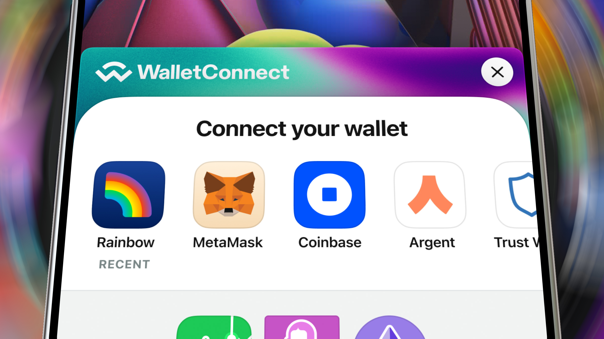

> Looking for v1.x readme? It is available on [V1 Branch](https://github.com/WalletConnect/web3modal/tree/V1)

# Web3Modal

Your on-ramp to web3 multichain.

⚠️ v2 is in early alpha and we are continuously adding more features, examples and documentation.

  

## Introduction

Web3Modal is an easy-to-use library to help developers add support for multiple providers in their apps with a simple customizable configuration. This library leverages WalletConnect V2 client ([repo](https://github.com/WalletConnect/walletconnect-monorepo/), [docs](https://docs.walletconnect.com/2.0/introduction/sign/)) and [Wagmi](https://wagmi.sh/).

By default Web3Modal library supports providers like:

- **Metamask**
- **Injected**
- **WalletConnect**
- **Coinbase Wallet**
- **Ledger**
- and many more to be added

## Quick Start

Getting started with web3modal is as easy as installing few packages, one for your prefared front-end framework i.e. `@web3modal/react` and chain ecosystem you are working with i.e `@web3modal/ethereum`. We will be expanding support to more choices very soon.

### 1. Obtain your WalletConnect projectId

Head over to [cloud.walletconnect.com](https://cloud.walletconnect.com/) to sign up and generate your projectId, which will be required to allow interactions with our explorer api and v2 protocol sdk's in the future.

### 2. Follow instructions and examples for your favourite framework

- [React Docs](./packages/react/) / [React Example](./examples/react/)
- Vue Docs / Vue Example (coming soon)
- Angular Docs / Angular Example (coming soon)
- Vanilla JS Docs / Vanila JS Example (coming soon)

### 5. Customise your modal!

As of now, we support the following config options to help you customise the look and feel of your modal.

- theme - `'dark' | 'light'`
- accentColor - `'blackWhite' | 'blue' | 'default' | 'green' | 'magenta' | 'orange' | 'purple' | 'teal'`

More options coming soon!
