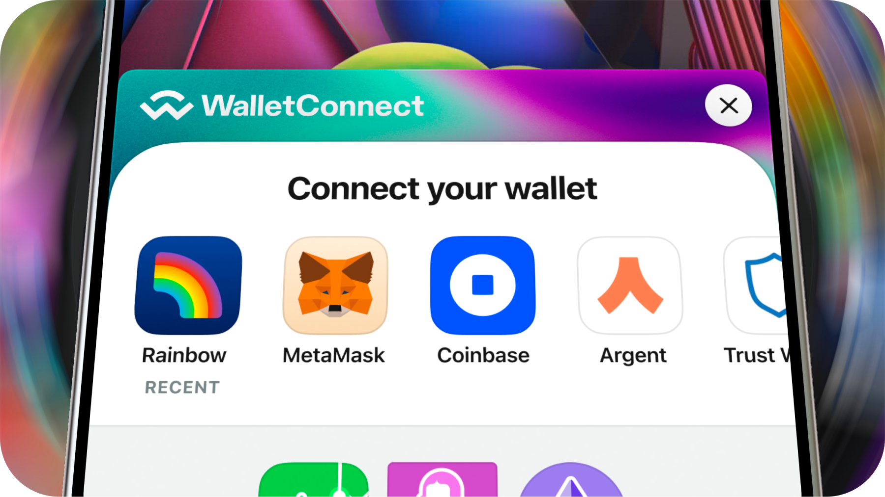

> [!NOTE]
> Looking for v2? [switch the branch](https://github.com/WalletConnect/web3modal/tree/V2).

#### 📚 [Documentation](https://docs.walletconnect.com/web3modal/about)

#### 🧪 [Laboratory](https://lab.web3modal.com)

#### 🔗 [Website](https://web3modal.com)

# Web3Modal

Your on-ramp to web3 multichain. Web3Modal is a versatile library that makes it super easy to connect users with your Dapp and start interacting with the blockchain.

<p align="center">
  
</p>

# Dev setup

1. Create `apps/laboratory/.env.local` file using the template from `apps/laboratory/.env.example`

2. In each of the `examples` create `.env.local` file with following contents

```zsh
VITE_PROJECT_ID="your_project_id"
```

3. Run `npm run watch` to build and watch for file changes in a separate tab
4. Run gallery, laboratory or examples in a separate tab i.e. `npm run laboratory`

# Releasing new versions

### Choose the packages you want to update and add a summary.

```sh
npm run changeset
```

### Version your latest change(s)

```sh
npm run changeset version
```

### Enter prelease mode

```sh
npm run changeset pre enter [tag]
```

### Steps

1. Run `npm outdated` and update dependencies
2. Run `npm install` and verify if everything still works correctly
3. Merge your feature branch into `V4`
4. Create a new branch from `V4` and name it with the version tag
5. Run `npm changeset` and set new custom version, enter prelease mode first if you want to add a tag to the version.
6. Update version in `ConstantsUtil` in `@web3modal/scaffold-utils` to the correct version
7. Create a new `PR` with Release Notes and merge into `V4`
8. Checkout `V4` and run `npm run publish:latest`
9. Draft a new release in GitHub and create new tag
10. Click on `Generate Change` and only leave the link with difference. Paste in your changelog from PR.
11. Check `Set as the last release` and publish release.
12. Update Web3Modal for https://web3modal.com/ (https://github.com/WalletConnect/www-web3modal) and create a PR
13. Update Web3Modal for https://app.web3inbox.com (https://github.com/WalletConnect/web3inbox) and create a PR

### Running tests

See <app/laboratory/tests/README.md>
