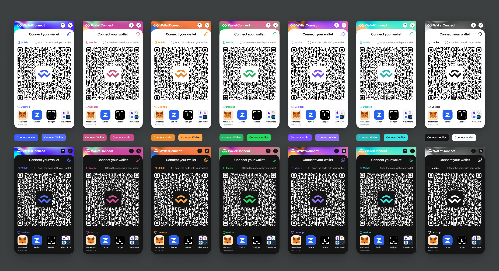

> Looking for v1.x readme? It is available on [V1 Branch](https://github.com/WalletConnect/web3modal/tree/V1)

### 📚 [Documentation](https://docs.walletconnect.com/2.0/web3modal/about)

### 🧪 [Laboratory](https://lab.web3modal.com)

### 🔗 [Website](https://web3modal.com)

# Web3Modal

Your on-ramp to web3 multichain. Web3Modal is a versatile library that makes it super easy to connect users with your Dapp and start interacting with the blockchain.

  

## Getting Started

- [React Docs](https://docs.walletconnect.com/2.0/introduction/web3modal/react/installation) / [Create React App Example](./examples/create-react-app) / [NextJS Example](./examples/nextjs)
- [Vanilla JS Docs](https://docs.walletconnect.com/2.0/web3modal/html-js/installation) / [Vanila JS Example](./examples/html/)
- Vue Docs / Vue Example (coming soon)
- Angular Docs / Angular Example (coming soon)

## Development

Please follow [developer docs](./.github/docs/development.md) to set up web3modal locally.
