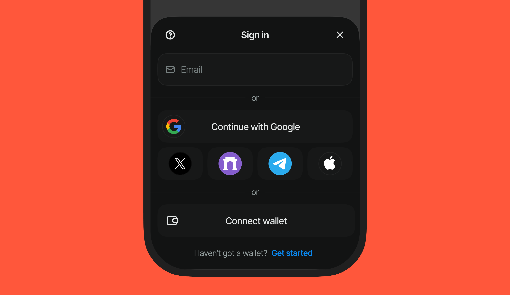

> [!NOTE]
> Looking for Web3modal v[1-5]? [switch the branch](https://github.com/WalletConnect/web3modal/tree/V5).

#### 📚 [Documentation](https://docs.reown.com/appkit/about)

#### 🧪 [Laboratory](https://appkit-lab.reown.org)

#### 🔗 [Website](https://reown.com/appkit)

# AppKit

Your on-ramp to web3 multichain. AppKit is a versatile library that makes it super easy to connect users with your Dapp and start interacting with the blockchain.

<p align="center">
  
</p>

# Dev setup

1. Create `apps/laboratory/.env.local` file using the template from `apps/laboratory/.env.example`

2. In each of the `examples` create `.env.local` file with following contents

```zsh
VITE_PROJECT_ID="your_project_id"
```

3. Run `pnpm watch` to build and watch for file changes in a separate tab
4. Run gallery, laboratory or examples in a separate tab i.e. `pnpm laboratory`

# Releasing new versions

> [!NOTE] 
> If you need to release a canary/alpha/beta, you need to enter prelease mode first.

### Enter prelease mode [Optional]

```sh
pnpm changeset:pre <release tag>
```

For example: `pnpm changeset:pre a123bas2`

### Generate changeset


```sh
pnpm changeset
```

### Steps

1. Run `pnpm update` and update dependencies
2. Run `pnpm install` and verify if everything still works correctly
3. Merge your feature branch into `main`
4. Changesets action will create or update a release PR
5. When such PR is merged, it will trigger an automatic deploy to npm and publish release on github

### Running tests

See <app/laboratory/tests/README.md>
